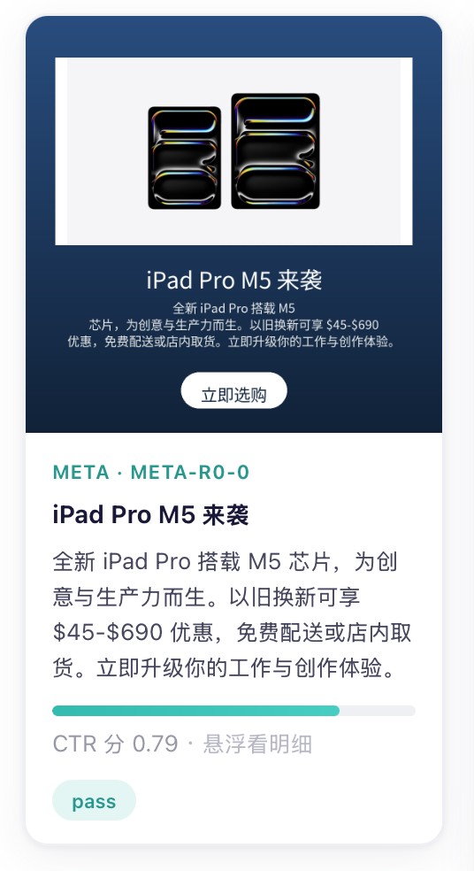

<a id="en"></a>
# AdPilot · Multimodal Ad-Delivery Agent

**English** · [中文](#zh)

[](LICENSE) · [](https://github.com/Shomao1998/adpilot/actions/workflows/ci.yml) · 153 tests passing · runs offline with **zero API keys**

Paste a product link or a keyword, and the agent runs the full loop — **creative generation → compliance review → campaign build → smart bidding → CTR pre-ranking → simulated delivery → cross-platform attribution → auto-optimization** — then compares the same product across Meta / Google / TikTok (simulated) in one dashboard.

> Job-portfolio project; it does **not** touch real ad budgets. Real delivery is replaced by a **data-driven simulator** — auction mechanics and user-behavior distributions are fitted from public industrial datasets (iPinYou / Criteo), so the "deliver → feedback → optimize" loop runs on realistic distributions rather than random numbers. The campaign layer uses the adapter pattern to align strictly with real platform API schemas; "going live" only means swapping the adapter implementation.

<p align="center">
  
</p>
<p align="center"><sub>A creative generated live (DeepSeek copy + fal.ai image + Pillow layout) with its CTR pre-ranking score — hover the card to see the four-dimension breakdown.</sub></p>

<!-- Optional: drop a dashboard screenshot/GIF at docs/dashboard.png and reference it here for extra impact. -->

## Features

- **Intent parsing**: product URL / keyword → structured brief (scrapes the page for selling points / price; at most one round of clarifying questions with sensible defaults for missing fields).
- **Multimodal creatives**: per-platform copy divergence (Meta long-form / TikTok hooks / Google RSA assets) + Pillow multi-size layout rendering.
- **Two-tier review**: L1 rule engine (banned words / absolute claims / restricted categories) + L2 LLM semantic review (exaggeration, factual contradiction), with reject/revise re-tries.
- **CTR pre-ranking (image-aware)**: LLM scores three copy dims (clarity / CTA / platform-fit) + local CV metrics analyze the actual rendered creative for the visual dim → four-dim quality score (feeds the click model) + top-3 take 70% of exploration budget. Gallery cards **flip on hover** to show the four-dim breakdown. The visual scorer is a **pluggable protocol** — swap in a VLM later without touching the layers above.
- **Bidding agent**: explainable rule-based policy (initial bid, marginal-ROAS budget reallocation, creative-fatigue detection, cost-overrun guard). Copilot mode: every suggestion carries reason / expected impact / confidence.
- **Delivery simulator**: second-price / GSP auction + data-driven impression/click/conversion sampling, with per-platform traffic and attribution differences.
- **Diagnosis**: a normalized metrics layer + LLM diagnosis report that reviews against the decision log and feeds back into bidding/creatives — closing the loop.
- **Imagery pipeline**: three-tier fallback — scrape the product hero image → fal.ai text-to-image → gradient template; text/CTA are always composited by Pillow (CJK fonts render correctly, both languages).
- **Bilingual, whole-platform**: one-click 中文 / English — the UI *and* LLM-generated content (brief / copy / review / diagnosis) stay in the chosen language.

## Use Case & Highlights

**Use case**: an SMB advertiser mixing Meta/Google/TikTok faces three pains — three back-offices, three report definitions that can't be compared directly, and creative iteration that can't keep up. AdPilot automates the whole chain from a single link; its core value is **normalizing three platforms onto one definition and feeding that back into budget decisions automatically**.

**Highlights**:

- **Cross-platform metric normalization** (the real business pain): the three platforms are **deliberately** given different attribution windows (7d/30d), timezones (LA/NY/UTC) and accounting bases (click-day / conversion-day); the normalization layer reconciles them — reproducing "platform reports aren't directly comparable" and verifiable against ground truth.
- **Event-sourced simulator**: the `auction → impression → click → conversion` event stream is append-only, so simulations are reproducible and auditable; platform reports are views derived from the stream, with ground truth kept alongside.
- **LangGraph state-machine orchestration** (not a free agent): ad delivery is a strongly-structured DAG, so determinism / checkpointing / auditability come first; the agent's freedom is used only for open-ended attribution in diagnosis.
- **Explainable bidding + decision trail**: explicitly no RL; every action lands in the decision log, and the dashboard visualizes "what was done, why, expected impact".
- **One input, one story (data lineage)**: the creatives generated by the wizard feed their CTR quality scores straight into the simulation — Campaign / Decision Log / cross-platform dashboard all reflect "delivering *these* creatives", each labeled "Your campaign / Sample data", removing the disconnect between pages.
- **Funnel navigation + trend annotations**: the five pages are organized as a numbered funnel `input → creatives → launch → simulate & tune → compare`; the final dashboard adds a "how to read" note, agent-adjustment-day markers, and start→end trend bars — turning "numbers" into "trends and causes".
- **Pluggable everything**: LLM via the `LLMClient` protocol (`ClaudeLLM` / `DeepSeekLLM` / offline `FakeLLM`, zero-cost reproducible tests); visual scoring via `VisualScorer` (local CV / future VLM); imagery via `ImageSource` (fal / SiliconFlow). "Going live" and "upgrading" only swap implementations.

## Architecture

```
Dashboard (webapp/, FastAPI + 5-page SPA, bilingual, funnel nav)
  ① Wizard → ② Creatives → ③ Campaign → ④ Decision Log → ⑤ Cross-platform
        │ REST
┌───────┴──────────────────────────────────────────────┐
│  LangGraph orchestration (adpilot/)                    │
│  intent → creative → review → CTR-rank → bid → sim → diagnose → next day │
│  bidding agent · CTR ranking · diagnosis agent · decision log            │
└───────┬───────────────────────────┬───────────────────┘
        │                           │
  Creative pipeline (adcreative/)   Campaign layer (adplatform/)
  intent·copy·review·layout          Meta/Google/TikTok mock adapters
        │                           │  (schema-aligned + ApiCallLog)
        └─────────────┬─────────────┘
                Delivery simulator (adsim/)
     2nd-price/GSP auction · click/conv models · event stream · per-platform reports
```

**Layers** (Python packages): `adsim` simulator core ｜ `adplatform` three-platform adapters ｜ `adcreative` creative pipeline ｜ `adpilot` orchestration + agents ｜ `webapp` dashboard.

**Key decisions**: ① state machine, not a free agent (controllable flow); ② adapter pattern in the campaign layer, schema copied from real APIs; ③ simulator and agent strictly decoupled (the agent doesn't know it's talking to a simulator); ④ deliberately different per-platform definitions; ⑤ USD-micros pricing throughout, no FX / currency conversion.

## Cloud Architecture (locally simulated)

Three cloud-relevant traits drive the design: two 1–2 min jobs (wizard, pilot simulation), in-process state that breaks on restart/scale, and locally-stored creative images. `docker-compose.cloud.yml` reproduces a **cloud-native topology on one machine** with open-source equivalents. The design is **cloud-agnostic** behind a single `ADPILOT_BACKEND=local|cloud` switch, so moving to any cloud swaps the managed services, not the app code.

```
GitHub Actions → build image → registry → deploy
        │
   [ load balancer / ingress ]
        │
  stateless web (FastAPI) ──enqueue──▶ [ queue ] ──▶ worker (pilot sim + LLM diagnosis)
        │  read / write                                  │ write result
        └───────────▶ [ Redis: state + job status ] ◀────┘
                      [ object storage + CDN: creative images ]
                      [ Postgres: completed-run history ]
                      [ secrets manager: API keys ]
```

`docker compose -f docker-compose.cloud.yml up` runs **web** + **worker** (one image, different command), **Redis** (state + RQ queue), **Postgres** (run persistence), **MinIO** (S3-compatible image store). The frontend's existing 202-pending polling slots straight into the async job model.

| Piece | Local sim | AWS | GCP | Azure |
|---|---|---|---|---|
| Stateless web / worker | Docker container | ECS Fargate | Cloud Run | Container Apps |
| Queue | Redis + RQ | SQS | Cloud Tasks | Service Bus |
| State / cache | Redis | ElastiCache | Memorystore | Azure Cache for Redis |
| Object storage | MinIO | S3 | GCS | Blob Storage |
| CDN | — | CloudFront | Cloud CDN | Front Door / CDN |
| Database | Postgres | RDS | Cloud SQL | PostgreSQL Flexible Server |
| Secrets | env | Secrets Manager | Secret Manager | Key Vault |

### Azure target (from prior Azure experience)

I've worked with this Azure stack before, so the natural production cut uses **Azure Container Apps** for web + worker, with the worker **scaling on Service Bus queue depth via KEDA** — it scales to zero when idle (cost-efficient for this bursty workload) and back up when pilot jobs pile in.

```
GitHub Actions ──build──▶ Azure Container Registry ──deploy──▶ Azure Container Apps
                                                                ├── web    (HTTP ingress)
                                                                └── worker (KEDA: scale on queue depth)
  Azure Service Bus           ← pilot-job queue
  Azure Cache for Redis       ← shared state / job status
  Azure Blob Storage + Front Door (CDN)  ← creative images
  PostgreSQL Flexible Server  ← completed-run history
  Azure Key Vault             ← DeepSeek / fal API keys (referenced by Container Apps)
  Application Insights / Log Analytics  ← decision log as structured traces
```

## API Services & Why (mostly cost)

External managed APIs are chosen primarily for **cost**, and each sits behind a swappable protocol (`LLMClient` / `ImageSource` / `VisualScorer`) so it can be replaced without touching the app:

| Need | Used | Why | Alternatives |
|---|---|---|---|
| LLM (intent / copy / review / CTR-rank / diagnosis) | **DeepSeek** (`deepseek-chat`) | OpenAI-compatible, ~1/10 the cost of frontier models, strong enough for these structured tasks | Claude (higher quality), any OpenAI-compatible endpoint |
| Text-to-image | **fal.ai** (FLUX.1-schnell) | `schnell` is the cheapest fast-Flux tier (~$0.003/image), simple REST | SiliconFlow (RMB billing, cheaper regionally), Replicate |
| Product hero image | scrape og:image / JSON-LD | free, no API | fal fallback |
| Creative visual score | local CV metrics | free, deterministic, in-process | a VLM later |

## Results

- **End-to-end, live**: paste a URL / keyword → DeepSeek writes copy + fal generates the image → creative CTR scores feed a 7-day simulated loop → daily diagnosis → auto-adjustments take effect (budget reallocation, fatigue-triggered creative refresh) — the same product across the whole chain.
- **Tests**: 153 cases all pass (`pytest`, in-memory SQLite, `FakeLLM` at zero API cost; includes falsifiable assertions on auction statistics, censored-fit ground-truth recovery, definition conservation, orchestration reproducibility).
- **Real LLM verified**: the five LLM paths (intent / copy / L2 review / CTR ranking / diagnosis) pass on both `claude-opus-4-8` and `deepseek-chat` — L2 catches factual contradictions, diagnosis ties budget mis-allocation to the decision log, and bilingual output stays consistent. See `LIVE-CHECKLIST.md`.
- **Change log**: see `CHANGELOG.md`.

## Quick Start

```bash
docker compose up --build     # starts the dashboard; ~20s to pre-warm the first simulation
# open http://localhost:8000
```

Defaults to **offline mode** — all five pages run with no API key; diagnosis narration uses a deterministic stub.

**Enable real LLM** (optional): set `ADPILOT_LIVE=1` + a key. Pick the provider via `ADPILOT_PROVIDER` — `claude` (`ANTHROPIC_API_KEY`) or `deepseek` (cheaper, `DEEPSEEK_API_KEY`). Then the Wizard can **paste a URL / keyword to generate creatives live**, and Creative Gallery / Campaign / Decision Log / dashboard all follow suit.
- **Text-to-image** (optional): set `ADPILOT_IMAGE_PROVIDER=fal` + `FAL_KEY` (or `siliconflow` + `SILICONFLOW_API_KEY`) to generate product images even from a keyword; otherwise it falls back to hero-image scraping / gradient.
- **Language**: the top-right dropdown toggles 中文 / English — both UI and generated content switch.

**Local dev** (no Docker):

```bash
pip install -e '.[web]'
uvicorn webapp.server:app --reload      # http://127.0.0.1:8000
pytest -q                               # run tests
```

**Cloud simulation** (multi-container, cloud-agnostic):

```bash
docker compose -f docker-compose.cloud.yml up --build
# dashboard http://localhost:8000 · MinIO console http://localhost:9001 (minioadmin/minioadmin)
```

Runs web + worker + Redis + Postgres + MinIO on one machine — see [Cloud Architecture](#cloud-architecture-locally-simulated).

## Known Limits & Next Steps (honest list)

- Simulation ≠ reality: distributions come from public datasets, not live traffic; noise is **deliberately** added between CTR pre-ranking scores and realized click-through, creating a "prediction vs reality" gap so diagnosis has something real to diagnose. Migration path: Meta sandbox → small-budget canary.
- Visual scoring is plan A (local CV metrics): it measures image **technical quality** (contrast / colorfulness / sharpness), a proxy for appeal, not semantic judgment. It's already a pluggable `VisualScorer` protocol — plug in a VLM (Claude vision / Qwen-VL) to upgrade to "look at the image" scoring without touching the layers above or the flip card.
- Budget reallocation uses "yesterday's ROAS" + a cooldown, so it lags on momentum (the diagnosis agent already flags this); a multi-day smoothed ROAS would help.
- Hero-image scraping is best-effort: works on cooperative sites (Shopify/DTC, most brand sites); large retailers with Cloudflare/Akamai bot protection or pure-JS rendering (403/202 empty responses) can't be scraped — those rely on fal text-to-image. Cutout / scene compositing is stubbed but not wired.
- Campaign (step 3) only launches platforms that have an approved creative, which may be fewer than the 3 the simulation runs (the decision log still simulates all three) — a minor inconsistency.

## Data & License

iPinYou / Criteo / Avazu and similar datasets are mostly academic / non-commercial licensed, which this portfolio project respects; they are used only to fit distribution parameters, and raw data is not committed.

---

<a id="zh"></a>
# AdPilot · 多模态广告投放 Agent

[English](#en) · **中文**

输入一个商品链接或关键词，Agent 自动完成 **创意生成 → 合规审核 → Campaign 构建 → 智能出价 → CTR 预排序 → 仿真投放 → 跨平台效果归因 → 自动优化** 的完整闭环，并在统一看板里对比同一标的物在 Meta / Google / TikTok（仿真）三平台的表现。

> 求职作品集项目，不接入真实广告预算。真实投放由**数据驱动的模拟器**替代——拍卖机制与用户行为分布来自 iPinYou / Criteo 等公开工业数据集，保证「投放—反馈—优化」闭环的数据分布真实，而非随机数。Campaign 层用适配器模式严格对齐真实平台 API schema，「转真」只需替换 adapter 实现。

## 功能

- **意图解析**：商品 URL / 关键词 → 结构化投放 brief（抓页提取卖点/价格，缺失字段一轮追问 + 默认值兜底）
- **多模态创意**：按平台调性分化文案（Meta 长文案 / TikTok 钩子 / Google RSA 资产）+ Pillow 多尺寸排版出图
- **两级审核**：L1 规则引擎（违禁词/绝对化用语/限制类目）+ L2 LLM 语义复审（夸大、事实矛盾），reject/revise 回流重试
- **CTR 预排序（图像感知）**：LLM 打文案三维（清晰度/CTA/平台匹配）+ 本地 CV 指标分析真实创意图打视觉分 → 四维综合质量分（喂点击模型）+ Top3 拿 70% 探索预算；画廊卡片悬浮翻转可看四维明细。视觉打分器做成可插拔协议，将来换 VLM 不动上层
- **出价 Agent**：可解释规则策略（初始出价、边际 ROAS 预算再分配、素材疲劳检测、超成本预警），Copilot 模式每条建议带理由/预期/置信度
- **投放模拟器**：二价 / GSP 拍卖 + 数据驱动的曝光/点击/转化采样，三平台差异化流量与归因口径
- **评估诊断**：归一化指标层 + LLM 诊断报告，结合决策日志复盘并反馈回出价/创意，形成闭环
- **配图管线**：URL 抓商品主图 → fal.ai 文生图 → 渐变模板 三级兜底；文字/CTA 由 Pillow 叠加（支持中英，CJK 字体正确渲染）
- **双语全平台**：中 / English 一键切换，界面与 LLM 生成内容（brief / 文案 / 审核 / 诊断）语言统一

## 应用场景和亮点

**场景**：中小广告主在 Meta/Google/TikTok 混投时的三大痛点——三套后台、三套报表口径没法直接比、素材迭代跟不上。AdPilot 用一个链接输入把全链路自动化，核心价值在**用统一口径把三平台效果拉齐并自动反馈到预算决策**。

**亮点**：

- **跨平台口径归一化**（真实业务核心痛点）：三平台**故意**设置不同归因窗口（7d/30d）、时区（LA/NY/UTC）、记账口径（点击日/转化日），归一化层负责拉齐——还原「各平台报表不可直接对比」并可对照 ground truth 验证正确性。
- **事件溯源模拟器**：`auction → impression → click → conversion` 事件流只追加，模拟可复现、可审计；平台报表是从事件流派生的视图，真值并存。
- **LangGraph 状态机编排**（非自由 Agent）：广告流程是强结构 DAG，确定性 / 可断点 / 可审计优先；Agent 的自由度只用在诊断的开放式归因上。
- **可解释出价 + 决策留痕**：明确不做 RL；每个动作进决策日志，看板可视化「做了什么、为什么、预期影响」。
- **一次输入贯穿一个故事（数据血缘）**：向导生成的创意，其 CTR 质量分直接喂进投放模拟——Campaign / 决策日志 / 跨平台看板全部反映「投放你这批创意」的结果，并统一标注「本次投放 / 示例数据」，消除各页面割裂感。
- **漏斗式导航 + 趋势注解**：五个页面组织成 `输入→创意→上线→模拟调优→对比` 的带序号漏斗；最终看板附「读图提示」、Agent 调整日标记、起止趋势条，把「数字」讲成「趋势与原因」。
- **provider / 打分器全可插拔**：LLM 走 `LLMClient` 协议（`ClaudeLLM` / `DeepSeekLLM` / 离线 `FakeLLM` 互换，测试零 API 成本）；视觉打分走 `VisualScorer` 协议（本地 CV / 将来 VLM 互换）；配图走 `ImageSource` 协议（fal / 硅基流动）。「转真」「升级」只换实现。

## 架构

```
看板 (webapp/, FastAPI + 五页 SPA, 中英双语, 漏斗式导航)
  ① 输入向导 → ② 创意画廊 → ③ Campaign → ④ 决策日志 → ⑤ 跨平台对比
        │ REST
┌───────┴──────────────────────────────────────────────┐
│  LangGraph 编排 (adpilot/)                             │
│  意图 → 创意 → 审核 → CTR预排序 → 出价 → 模拟 → 诊断 → 次日 │
│  出价Agent · CTR预排序 · 诊断Agent · 决策日志            │
└───────┬───────────────────────────┬───────────────────┘
        │                           │
  创意管线 (adcreative/)      Campaign层 (adplatform/)
  意图·文案·审核·排版          Meta/Google/TikTok Mock适配器
        │                           │  (schema对齐真实API + ApiCallLog)
        └─────────────┬─────────────┘
                投放模拟器 (adsim/)
        二价/GSP拍卖 · 点击/转化模型 · 事件流 · 口径差异报表
```

**分层**（Python 包）：`adsim` 模拟器内核 ｜ `adplatform` 三平台适配器 ｜ `adcreative` 创意管线 ｜ `adpilot` 编排 + Agent ｜ `webapp` 看板。

**关键决策**：① 状态机而非自由 Agent（强流程可控）② Campaign 层适配器模式、schema 照抄真实 API ③ 模拟器与 Agent 严格解耦（Agent 不知在跟模拟器对话）④ 三平台故意不同口径 ⑤ 全程 USD micros 计价，无汇率/币种转换。

## 云架构（本地模拟）

三个"云相关"特征驱动设计：两个 1–2 分钟的长任务（向导、pilot 模拟）、进程内状态（重启/扩容即丢）、创意图存本地。`docker-compose.cloud.yml` 用开源等价物在**单机上重现一套云原生拓扑**。设计**云无关**——一个 `ADPILOT_BACKEND=local|cloud` 开关切换，换任意云只替换托管服务、应用零改动。

```
GitHub Actions → 构建镜像 → 镜像仓库 → 部署
        │
   [ 负载均衡 / ingress ]
        │
  无状态 Web (FastAPI) ──入队──▶ [ 队列 ] ──▶ worker (pilot 模拟 + LLM 诊断)
        │  读/写                                 │ 写结果
        └──────────▶ [ Redis: 状态 + job 状态 ] ◀─┘
                     [ 对象存储 + CDN: 创意图 ]
                     [ Postgres: 完成结果历史 ]
                     [ Secrets Manager: API keys ]
```

`docker compose -f docker-compose.cloud.yml up` 起 **web** + **worker**（同一镜像不同命令）、**Redis**（状态+RQ 队列）、**Postgres**（结果持久化）、**MinIO**（S3 兼容图片存储）。前端本来就有的 202-pending 轮询正好接上异步任务模型。

| 部件 | 本地模拟 | AWS | GCP | Azure |
|---|---|---|---|---|
| 无状态 web / worker | Docker 容器 | ECS Fargate | Cloud Run | Container Apps |
| 队列 | Redis + RQ | SQS | Cloud Tasks | Service Bus |
| 状态 / 缓存 | Redis | ElastiCache | Memorystore | Azure Cache for Redis |
| 对象存储 | MinIO | S3 | GCS | Blob Storage |
| CDN | — | CloudFront | Cloud CDN | Front Door / CDN |
| 数据库 | Postgres | RDS | Cloud SQL | PostgreSQL Flexible Server |
| 密钥 | env | Secrets Manager | Secret Manager | Key Vault |

### Azure 落地（基于既有 Azure 经验）

我之前用过这套 Azure 技术栈，所以生产版自然选 **Azure Container Apps** 跑 web + worker，worker **按 Service Bus 队列深度经 KEDA 伸缩**——空闲缩到 0（这种突发型负载最省钱），pilot 任务堆积时再弹起来。

```
GitHub Actions ──构建──▶ Azure Container Registry ──部署──▶ Azure Container Apps
                                                              ├── web    (HTTP ingress)
                                                              └── worker (KEDA: 按队列深度伸缩)
  Azure Service Bus           ← pilot 任务队列
  Azure Cache for Redis       ← 共享状态 / job 状态
  Azure Blob Storage + Front Door (CDN)  ← 创意图
  PostgreSQL Flexible Server  ← 完成结果历史
  Azure Key Vault             ← DeepSeek / fal 的 API key（Container Apps 引用）
  Application Insights / Log Analytics  ← 决策日志作为结构化追踪
```

## API 服务与选型理由（基本都因为便宜）

外部托管 API 主要按**成本**选，且每个都藏在可换协议（`LLMClient` / `ImageSource` / `VisualScorer`）后面，换供应商不动应用：

| 需求 | 选用 | 为什么 | 备选 |
|---|---|---|---|
| LLM（意图/文案/审核/CTR排序/诊断） | **DeepSeek**（`deepseek-chat`） | OpenAI 兼容，成本约为前沿模型的 1/10，对这些结构化任务够用 | Claude（质量更高）、任意 OpenAI 兼容端点 |
| 文生图 | **fal.ai**（FLUX.1-schnell） | schnell 是最便宜的快档 Flux（约 $0.003/张），REST 简单 | 硅基流动（人民币结算、区域更便宜）、Replicate |
| 商品主图 | 抓 og:image / JSON-LD | 免费、无需 API | fal 兜底 |
| 创意视觉分 | 本地 CV 指标 | 免费、确定性、进程内 | 将来接 VLM |

## 效果

- **端到端实时跑通**：粘贴 URL / 关键词 → DeepSeek 生成文案 + fal 出图 → 创意 CTR 分喂进 7 模拟日闭环 → 每日诊断 → 自动调整生效（预算再分配、疲劳触发创意迭代），全链路同一商品。
- **测试**：153 个用例全部通过（`pytest`，内存 SQLite，`FakeLLM` 零 API 成本；含拍卖统计性质、删失拟合恢复真值、口径守恒、编排复现性等可证伪断言）。
- **真实 LLM 已验证**：意图/文案/L2审核/CTR预排序/诊断五路径在 `claude-opus-4-8` 与 `deepseek-chat` 上均实测通过——L2 能抓出事实矛盾，诊断能结合决策日志指出预算错配；中英双语输出统一。详见 `LIVE-CHECKLIST.md`。
- **迭代记录**：见 `CHANGELOG.md`。

## 快速开始

```bash
docker compose up --build     # 起看板，约 20s 完成首轮模拟预热
# 打开 http://localhost:8000
```

默认**离线模式**，无需任何 API key 即可跑全部五个页面。诊断复述用确定性 stub。

**开启真实 LLM**（可选）：设 `ADPILOT_LIVE=1` + key。provider 由 `ADPILOT_PROVIDER` 选——`claude`（`ANTHROPIC_API_KEY`）或 `deepseek`（更便宜，`DEEPSEEK_API_KEY`）。开启后「输入向导」可**粘贴 URL / 关键词实时生成创意**，创意画廊 / Campaign / 决策日志 / 看板全部随之联动。
- **文生图**（可选）：设 `ADPILOT_IMAGE_PROVIDER=fal` + `FAL_KEY`（或 `siliconflow` + `SILICONFLOW_API_KEY`），关键词也能生成产品图；不设则回退抓主图 / 渐变。
- **语言**：右上角下拉切 中 / English，界面与生成内容一并切换。

**本地开发**（不用 Docker）：

```bash
pip install -e '.[web]'
uvicorn webapp.server:app --reload      # http://127.0.0.1:8000
pytest -q                               # 跑测试
```

**云模拟**（多容器，云无关）：

```bash
docker compose -f docker-compose.cloud.yml up --build
# 看板 http://localhost:8000 · MinIO 控制台 http://localhost:9001 (minioadmin/minioadmin)
```

单机起 web + worker + Redis + Postgres + MinIO——见[云架构（本地模拟）](#云架构本地模拟)。

## 已知局限与下一步（诚实清单）

- 模拟 ≠ 真实：分布来自公开数据集而非真流量；CTR 预排序分到真实点击率之间**刻意加了噪声**制造「预估与现实的差距」，让诊断有真东西可诊。迁移路径：Meta 沙盒 → 小预算灰度。
- 视觉打分是 A 方案（本地 CV 指标）：度量的是图像**技术质量**（对比度/色彩/清晰度），是审美的代理，非语义审图。已做成 `VisualScorer` 可插拔协议，接入 VLM（Claude vision / Qwen-VL）即升级为「看图打分」，上层与翻转卡不动。
- 出价再分配用「昨日 ROAS」+ 冷却，存在追涨杀跌滞后（诊断 Agent 已能自行指出）；可改多日平滑 ROAS。
- 抓主图是尽力而为：对配合的站点（Shopify/DTC、多数品牌官网）有效；对带 Cloudflare/Akamai 反爬或纯 JS 渲染的大型零售站（403/202 空响应）抓不到——这类站靠 fal 文生图兜底。抠图/场景合成留接口未接。
- Campaign 第 3 步只上线有过审创意的平台，可能少于模拟的 3 家（决策日志仍模拟全部三平台），轻微不一致。

## 数据与许可

iPinYou / Criteo / Avazu 等数据集多为学术/非商业许可，本作品集项目符合；仅用于拟合分布参数，原始数据不进仓库。
